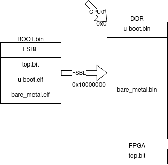

# AMP

В случае AMP одно из ядер является мастером а другое слейвом. Мастером в нашем случае будет U-Boot, слейвом соответственно bare metal. Также было решено не реализовывать никакой синхронизации или ограничения доступа к памяти. Синхронизация потребовала бы слишком большой переделки u-boot-а. Было решено что мы просто не используем ресурсы одновременно и не лезем в чужую память.  
Таким образом сборка u-boot не требует никаких изменений. U-Boot будет загружаться по нулевому адресу и сможет доступаться ко всей памяти.
Сборка Bare Metal требует изменений. Нужно изменить стартовый адрес и указать компилятору что это ядро - слейв, более подробно описано в [Сборка Bare metal](# Сборка Bare metal). Также важно запомнить стартовый адрес, чтобы указывать его при запуске ядра

Для включения второго ядра нужно сделать 3 вещи(ug585 6.1.10):  

- положить bin файл в оперативную память, перед этим скомпилировав его из elf.
- положить по адресу `0xFFFFFFF0` адрес этого бинарника.
- сбросить кэш, `dcache flush`.
- сделать sev, `__asm__("sev");`.

Для понимания надо знать процесс загрузки первого ядра: сначала стартует BootROM, он загружает FSBL с флешки в OCM, когда FSBL загружен, ищет по флешке и загружает битстримы в ПЛИС, .elf компилирует и загружает в память, по адресам указанными линькером при сборке. После загрузки передает управление на 0x0 - handoff.  

|                                                                    |
|-----------------------------------------------------------------------------------------|
| Пример работы FSBL: загрузочный образ состоит из fsbl, битстрима, u-boot и bare metal.  |
| U-boot собран с дефолтными настройками.                                                 |
| Bare metal собран с Base Addr = 0x10000000.                                             |

Таким образом после того как отработает fsbl у нас будут загруженные в память бинарники и загруженный в ПЛИС битстрим.

## Запуск второго ядра из FSBL
Также fsbl, если его создавать отдельным проектом, позволяет добавить хуки. Есть хук перед handoff. Нужно в него добавить запись адреса последнего elf-а в `0xFFFFFFF0` и выполнение `__asm__("sev");`. Но Был выбран другой вариант решения 

## Запуск второго ядра из U-Boot

Реализуем алгоритм загрузки описанный ранее. Загрузку и компиляцию elf выполняет fsbl. U-Boot-у же нужно только записать адрес куда загружена программа для второго ядра и сделать sev. Записать адрес можно через встроенную команду nm. Для вызова sev нужно добавить команду.

В /cmd/sev.c пишем:
```
#include <common.h>
#include <command.h>

int do_sev(struct cmd_tbl *cmdtp, int flag, int argc,
		   char *const argv[]){
    __asm__("sev");
    return CMD_RET_SUCCESS;
}

U_BOOT_CMD(sev,	1,	0,	do_sev,
	   "Just asm sev", "Just asm sev"
);
```

В /cmd/Makefile добавляем:

```
obj-y+=sev.o
```

Перекомпилируем u-boot и добавляем в образ bare_metal.elf
Заливаем образ на флешку, перезагружаемся, и пишем:
```
Zynq> nm 0xFFFFFFF0
fffffff0: ffffff2c ? 0x10000000
fffffff0: 10000000 ? q
Zynq> sev
```

Также для удобства можно объявить две переменных
```
setenv cpu1_addr 0x10000000
setenv cpu1_bare_metal /var/lib/tftpboot/xilinx/bare_metal.bin
setenv cpu1_start 'mw.l 0xFFFFFFF0 $cpu1_addr 1; dcache flush; sev'
setenv cpu1_fetch 'dhcp $cpu1_addr $tftpip:$cpu1_bare_metal'
```
cpu1_addr - адрес начала, взятый из lscript.ld. cpu1_start запускает второе ядро по этому адресу.


## Сборка Bare metal

Для правильной работы в AMP нужно:

- Во-первых установить флаг компилятору. В этом режими одно ядро является мастером, другое слейвом. Слев должен обращаться к переферии через хуки у мастера. Надо указать это компилятору. Открываем platform.xpr - Modify BSP settings - ps7_cortexa9_1 - extra_compiler_flags, дописываем `-DUSE_AMP=1`
- Во-вторых изменить стартовый адрес памяти. Чтоб выполнение программы начиналось не с 0x0, где лежит u-boot. Идем в Explorer - application - src - lscript.ld. Ищем настройку ps7_ddr_0. Ставим желаемый адресс в Base Address, например 0x10000000.

## Загрузка второго ядра по JTAG

Сначала запускаем u-boot, по инструкции по его запуску через JTAG.  
Теперь нужно загрузить программу в память.
 ```
 stop
 dow -data ~/xilinx/vitis/bootimg/bare_metal_application.bin 0x10000000
 con
 ```
При этом важно помнить, что загружать надо .bin файл, который можно получить из elf с помощью `arm-none-eabi-objcopy -O binary bare_metal_cpu1.elf bare_metal_cpu1.bin`.
После этого запускаем второе ядро.
```
Zynq> nm 0xFFFFFFF0
fffffff0: ffffff2c ? 0x10000000
fffffff0: 10000000 ? q
Zynq> sev
```