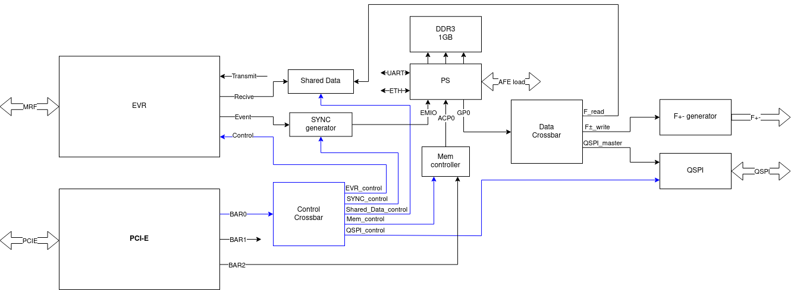

# Функциональная схема

# Процессор
Процессор имеет три функции: два ядра и мост из программируемой логики в память.
#### Мост в память
Внутренний интерконнект процессора используется для предоставления доступа к оперативной памяти программируемой логике, через порт ACP0. Контроллер памяти обеспечивает кеш когерентность между ядрами и ПЛИС.

#### Первое ядро
На первом ядре запущен U-Boot. Используется для сервисных целей. Помимо стандартных средств U-Boot планируются два дополнения: утилита для запуска второго ядра, утилита для прошивки afe.
#### Второе ядро
На втором ядре запущено bare metal приложение. Программа взаимодействует с программируемой логикой через AXI порт GP0 и EMIO. Примерный алгоритм работы представлен на картинке. 
 
Процессор ждет сигнал синхронизации с модуля SYNC detector, пулля один из своих EMIO. 
По приходу синхронизации читает сигналы с пинапов, с платы afe по QSPI. 
Также читает текущую частоту, из регистра shared data/ 
Высчитывает обратную связь, по формуле описаной в тз. Коэффициенты обратной связи хранятся в памяти процессора, и могут быть записаны через PCIe.
Добавляет feedforward, по таблице, таблица хранится в памяти, и тоже может быть записана через PCIe. 
Во время расчета пишет логи, в память. Логи затем могут быть прочитаны через PCIe.
Результат расчета, поправку - fixed point число, записывает в модуль F+- generator.
На этом цикл работы окончен, снова начинает пуллить сигнал синхронизации.

# Внутренние интерфейсы
Для общения модулей выбран интерфейс AXI4-Lite, на 100 МГЦ частоте получаемой с EVR. Есть 2 потока: данных и управления(помечен синим). В потоке данных мастером является второе ядро процессора. Управление осуществляется через BAR0.

# PCI-E
Модуль PCIe сделан в виде блочного дизайна, внутренний кроссбар имеет три входа, соответствующих барам. Размеры баров: 64 Кб, 128 Кб, 1 Мб. 
BAR2 используется для обращения к памяти, BAR0 - к конфигурационным регистрам.
# Mem controller
Так как размер BAR2 равен 1 Мб, а памяти 1Гб, то необходим модуль, задающий сдвиг от начала памяти, до начала 1 Мб окна. Должен иметь один регистр, сдвиг, и прибавлять его к адресу.

# QSPI
Модуль конвертирующий транзакции AXI в QSPI. Используется портированый с llrf, для совместимости с afe.

# F+- generator
Тк F+- должны генерироваться на частоте 25 МГц. Нужен отдельный модуль, с одним регистром - сколько импульсов сгенерировать.

# MRF 
Модуль EVR принимает события и данные из сети MRF. Используется от LLRF.
Модуль SYNC generator генерирует синхроимпульсы для процессора, управляется ивентами.
Модуль Shared Data содержит 1 регистр с текущей частотой, который пишется из MRF