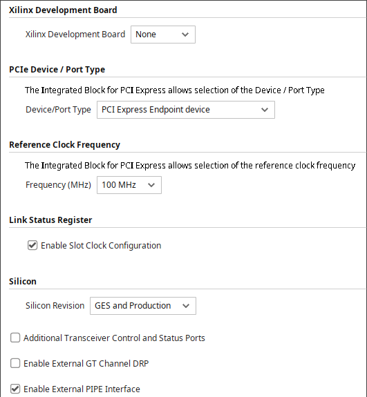
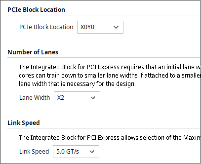
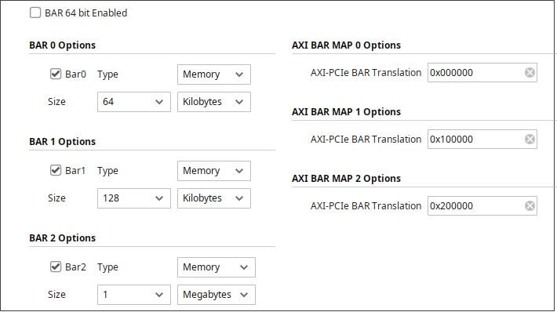
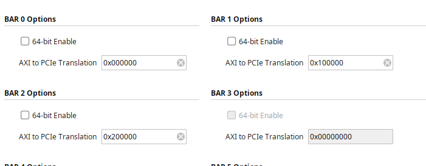
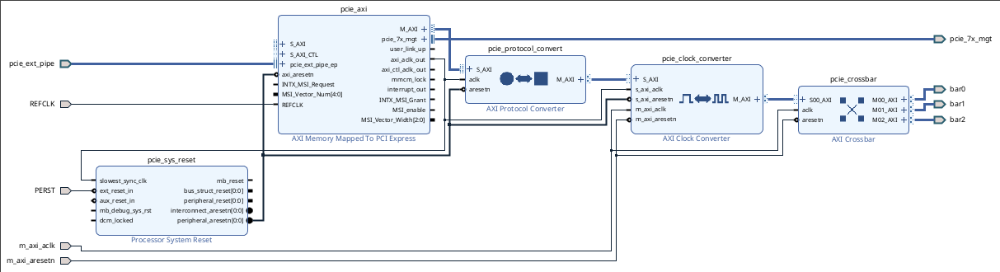

# PCI-Express
## Корка
| Настройки корки:                |
|---------------------------------|
|  |
|  |
|  |
|  |

## Нюансы корки
Для быстрой симуляции нужно включить PIPE.   

AXI работает на частоте 125 МГЦ, генерируемой на axi_aclk_out.  
Входа PERST у корки нет, в качестве него используется axi_arsetn.   

На AX7015 lane 0 и lane 1 поменяны местами, материнка lane reversal, таким образом получается, что в режиме х2 pcie работает, в х1 - нет. Можно ли в ПЛИС софтверно поменять местами lane, я не понял.    

[Рабочие констрейны](ax7015.xdc)

## Блочный дизайн

Модуль PCIE в проекте реализован в виде блочного дизайна. Из корки выходит AXI4, поэтому в блочном дизайне добавлены - protocol converter, clock converter, data wide converter(самописный, rtl), crossbar. Это позволяет получить 3 AXI-Lite, 32 битных, в 100 МГЦ клоковом домене.

## Симуляция 
Для симуляции есть две опции: симуляция через PIPE, или простая генерация транзакций на AXI.  
В случае AXI используется файл pcie/axi_model.sv. Реализован AXI мастер. Для PIPE был адаптирован пример, идущий вместе с корокой.   

Для выбора способа симуляции служит `define PCIE_PIPE_STACK`. Тесты пишутся в файле pcie/pcie_tests.svh. Вне зависимосто от способа, управление осуществляется двумя тасками: pci_e_write, pci_e_read. 