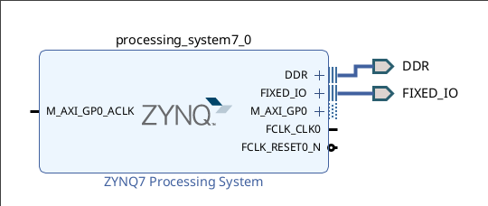
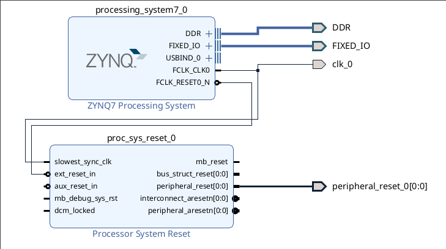

# Процессор

К blink-у добавляем процессор.
Процессор можно добавить только через блочный дизайн. У блочного дизайна есть проблема - он может менять местами выходы сигналы у Verilog модуля.
Было решено писать топ на SystemVerilog, в него подключать файлы сгенерированиые блочным дизайном.

- Создаем блочный дизайн. Flow Navigator - IP Integrator - Create block design.
- Теперь надо добавить процессор. ПКМ - Add IP..., выбераем ZINQ7 processing system. После этого вылезет зеленое окно "Designer Assistance is avaluble". Можно нажать Run Block automatization и тогда автоматически сгенерируются выходы блочного дизайна и процессор к ним подключится. Также выходы и входы можно создать самому, ПКМ - Create port.  

| Получится так                                    |
|--------------------------------------------------|
|                             |
|                                                  |

- По умолчанию у процессора включен Master GP0 AXI, PL Clock 0, PL Reset 0. Все можно отключить: Customize block - PS-PL Configuration - AXI Non Secure Enablement - M AXI GP0 Interface, Customize block - Clock configuration - Pl Fabric clock - FCLK_CLK0, Customize block - PS-PL Configuration - General - Enaple Clock Reset - FCLK_RESET0. В Customize block есть и другие настройки. Также можно использовать TCL скрипты - пресеты, получилось найти такой для PINQ Z1.

- В дереве проекта идем в Design sources, и нажимаем ПКМ на файл с блочным дизайном, выбираем Generete output products. Vivado генерирует Verilog файл с оберткой процессора и pin assignment. Pin assignment не надо прописывать вручную, vivado автоматически добавляет его к проекту.

- Пишем топ модуль, в котором инстанцируем обертку. Собираем проект. В такой конфигурации можно заливать в плату. Можно написать программу для процессора в Vitis.

## Clock и Reset

ПЛИС может потребоваться клок и ресет от процессора. Клок можно взять FCLK_CLK0. Ресет просто взять как FCLK_RESET0_N Vivado не даст, будет ошибка "[PFM-2] pfm_clock - cannot determine the reset ports associated to 'FCLK_CLK0' on instance 'processing_system7_0'. Please define a proc_sys_reset block or a list of three required reset ports: peripheral_reset, interconnect_aresetn and peripheral_aresetn.". Для решения этой проблемы можно использовать блок proc_sys_reset или указать 3 ресета, при этом тоже возникают [проблемы](https://support.xilinx.com/s/article/60585?language=en_US). Я брал proc_sys_reset, затем делал Run Block automatization. 

| Получится так                                    |
|--------------------------------------------------|
|                       |
|                                                  |

## Материалы

- [Пресет для PINQ Z1](pynq_revC.tcl)