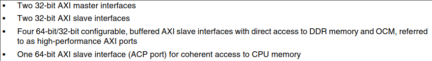
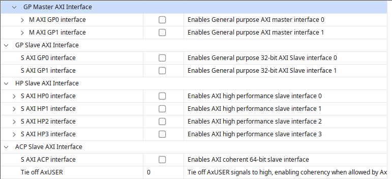
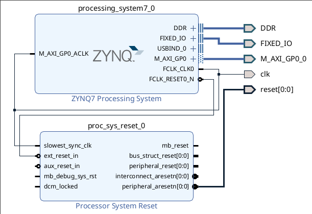
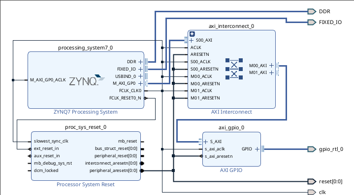

# Взаимодействие PS-PL

Для взаимодействия с ПЛИС процессор используешь шину AXI. Есть 2 мастера и 2 слейва общего назначения - GP, 4 слейва с доступом в память - HP, 1 слейв с когерентным доступом в память - ACP. Включаются они в Customize block - PS-PL Configuration.

| Data Sheet                        | Vivado                      |
|-----------------------------------|-----------------------------|
|     |  |
|                                   |                             |

## Взаимодействие через GP

По умолчанию у процессора включен GP0. 

Можно вывести интерфейсы и использовать прям так. Тогда нужно самому писать переферийный слейв, со стороны процессора нужно будет вручную писать в регистры этого модуля. Также есть [статья](https://habr.com/ru/articles/535226/), где используются встроеные механизмы Vivado, но нужен дополнительный модуль в блочном дизайне.

| Тогда получится так                              |
|--------------------------------------------------|
|         |
|                                                  |

Есть набор стандартных модулей для AXI: crossbar, gpio, qspi, uart... Для всех этих модулей Vitis генерирует драйвера для линукса и bare metal. Тогда самый простой способ, например, помигать светодиодом с процессора такой: поставить кроссбар и модуль GPIO.

| Получится так                                    |
|--------------------------------------------------|
|                         |
|                                                  |

В такой конфигурации Vitis сам сгенерирует драйвера для GPIO.
