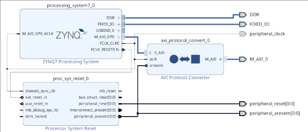
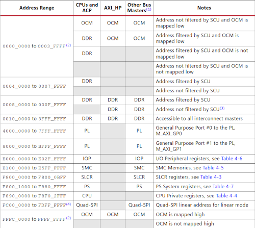

# Взаимодействие PS-PL
Для интерфейса взаимодействия ПЛИС с процессором был выбран AXI4-Lite.
Для начала нужен модуль с AXI, например 4 регистра памяти. Его можно сгенерировать в Tools - Create and package new IP. Так Vivado создает Verilog код AXI4-Lite слейва. У него есть проблема - большое количество выводов. По этому, для удобства было решено написать обертку на SystemVerilog, используя интерфейс, код [тут](axi_if.svh).   
Теперь изменяем блочный дизайн. У процессора включаем M_GP0_AXI и добавляем переходник с AXI3 на AXI4-Lite. Также в Address Editor назначаем какие нибудь адреса. Генерируем код. Пишем обертку для процессора с использованием интерфейса.    
Собираем битстрим, экспортируем Hardware Platform. Важно: необходимо перекомпилировать FSBL и U-Boot.  
Теперь пишем код для работы с процессора. Адреса 0x40000000-0x7fffffff назначены GP0.

| Адресная карта Zynq       |
|---------------------------|
|  |
|                           |
