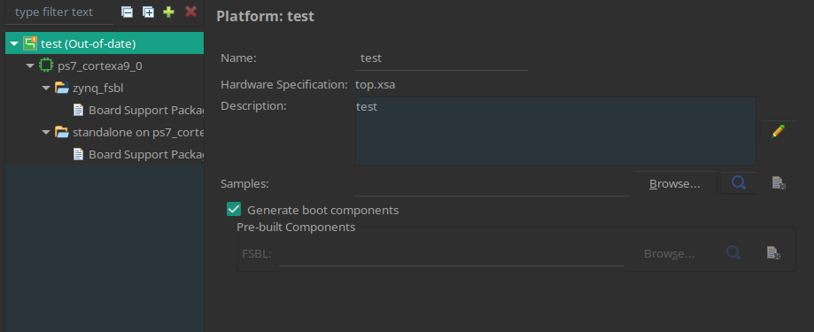

# Vitis

- Для работы в Vitis нужен файл Hardware specification(.xsa), генерируем его после сборки битстрима, через Export - Export Platform..., важно поставить галочку Include Bitstream.
- Для разработки приложений в Vitis надо создать сначала платформу, Platform project. Выбираем XSA файл. Выбираем операционную систему standalone, это bare metal. Процессор можно поставить любой. Галочку Generate boot component не убирать. Так Vitis создаст Board Support Package(BSP) и FSBL.

| Откроется такое окно                             |
|--------------------------------------------------|
|                         |
|                                                  |

Тут есть 2 домена zinq_fsbl и standalone. Как я понял домен отвечает за BSP, набор библиотек для работы с железом процессора. Для разных ядер можно делать разные домены, для AMP.

- Теперь надо создать приложение, Application project. В качестве платформы выбираем только что созданную.